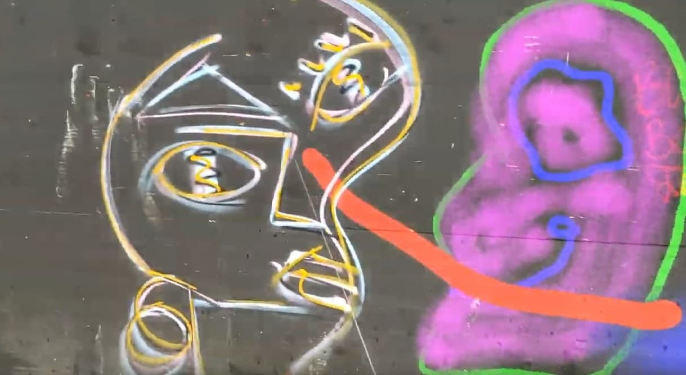

# P05-Virtual-Graffiti

A virtual graffiti app for the HoloLens 2.

 
https://www.youtube.com/watch?v=VS3SNHswBl4

# HoloLens 2 Setup documentation

## Software requirements
### [Unity 2019.2](https://unity3d.com/get-unity/download/archive):
- [Unity 2019.2.21](unityhub://2019.2.21f1/9d528d026557)
- [Unity 2019.4.11](unityhub://2019.4.11f1/2d9804dddde7) (used in the presentation)
- [Unity 2019.4.12](unityhub://2019.4.12f1/225e826a680e) (this is what we're using now)
### Visual Studio 2019
- VS 2019 - 16.7.4 (used in the presentation)
(in the visual studio installer -> modify -> individual components)
#### Windows 10 SDK
- latest (install in visual studio 2019 -> package manager or visual studio installer)
#### USB device connectivity
- latest (install in visual studio 2019 -> package manager or visual studio installer)
#### C++ Universal Windows platform support
### MRTK
- MRTK 2.4.0 (used in the presentation)

## Other requirements
- install/enable developer mode in Windows Settings -> For Developers
- enable device discovery 

## Scene Understanding API
I added an example for the scene understanding API (MixedReality-SceneUnderstanding-Samples-master.zip) so just clone that one.

https://docs.microsoft.com/en-us/windows/mixed-reality/develop/platform-capabilities-and-apis/scene-understanding-sdk

First install this if you haven't already: https://github.com/GlitchEnzo/NuGetForUnity

Next, add the following package by searching:
Microsoft.MixedReality.SceneUnderstanding

Then that should work

## Mixed Reality Device Portal
for windows

## Other useful stuff

Useful voice command: "what is my ip"

### Connect the hololens to your pc
- in the hololens (tap below your palm gesture) to open the menu
- settings
- for developers
- unpair/pair the device with your pc

## Compiling
### In Unity
1. File -> Build Settings -> (Universal Windows Platform) -> build

2. Build it to some folder to open later

### In VS2019
1. Open the .sln in the folder you built earlier
2. Select Release - ARM - Device and run

Note: the device needs to be **connected** and **paired** with your windows (unpair the hololens first from other devices in its developer settings, then click pair in the hololens to get the PIN for VS).
